# Consul Service Mesh: Multi-Cluster E-Commerce Platform

Multi-cluster, multi-cloud deployment of the [Google Online Boutique](https://github.com/GoogleCloudPlatform/microservices-demo) e-commerce application using [HashiCorp Consul](https://www.consul.io/) as a service mesh, with cross-cluster failover between AWS EKS and Linode LKE.

Based on the [Consul Crash Course](https://www.youtube.com/watch?v=s3I1kKKfjtQ) by **TechWorld with Nana**.

## Architecture

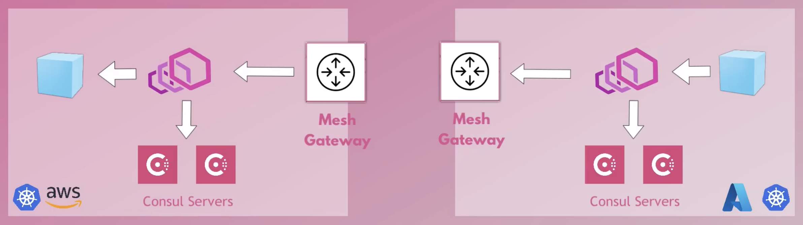
*Diagram from [TechWorld with Nana](https://www.youtube.com/watch?v=s3I1kKKfjtQ)*

Two Kubernetes clusters (AWS EKS and Linode LKE) are connected via Consul cluster peering through mesh gateways. The primary cluster (EKS) runs all 11 microservices, while the secondary cluster (LKE) runs `shippingservice` as a failover target. If `shippingservice` on EKS goes down, Consul automatically routes traffic to LKE via the mesh gateways.

## Microservices (Google Online Boutique)

The e-commerce app consists of 11 microservices using **publicly available GCP container images** from `gcr.io/google-samples/microservices-demo/`.

| Service | Language | Description |
|---------|----------|-------------|
| frontend | Go | Web UI serving the storefront |
| cartservice | C# | Manages shopping cart (backed by Redis) |
| productcatalogservice | Go | Product listing and search |
| currencyservice | Node.js | Currency conversion |
| paymentservice | Node.js | Credit card payments (mock) |
| shippingservice | Go | Shipping cost estimates and tracking |
| emailservice | Python | Order confirmation emails (mock) |
| checkoutservice | Go | Orchestrates the checkout flow |
| recommendationservice | Python | Product recommendations |
| adservice | Java | Contextual advertisements |
| redis-cart | Redis | In-memory store for cart data |

## Repository Structure

```
consul-service-mesh/
|-- README.md
|-- terraform/                   # AWS EKS cluster provisioning
|   |-- main.tf                  # VPC + EKS cluster definition
|   |-- variables.tf             # Configurable variables (region, CIDR, etc.)
|   |-- providers.tf             # Terraform provider requirements
|   +-- data.tf                  # AWS availability zones data source
|-- kubernetes/                  # Kubernetes and Consul manifests
|   |-- config.yaml              # Original GCP microservices manifests (no Consul)
|   |-- config-consul.yaml       # Consul-adapted manifests (with sidecar annotations)
|   |-- consul-values.yaml       # Helm values for Consul on EKS (gp2 storage)
|   |-- consul-values-lke.yaml   # Helm values for Consul on LKE (linode storage)
|   |-- consul-mesh-gateway.yaml # Mesh gateway peering configuration
|   |-- exported-service.yaml    # Export services to peered clusters
|   |-- service-resolver.yaml    # Failover routing rules
|   |-- intentions.yaml          # Service-to-service authorization
|   |-- debug-pod.yaml           # Curl debug pod for troubleshooting
|   +-- values-examples-with-explanations.yaml
+-- screenshots/                 # Evidence of working system
```

## File Descriptions

### Terraform

- **`main.tf`**: Provisions an AWS VPC (3 public + 3 private subnets) and an EKS cluster with 3 `t3.small` worker nodes. Includes the EBS CSI driver addon required by Consul for persistent storage.
- **`variables.tf`**: Configurable parameters, including AWS region (default `ap-southeast-1`), VPC CIDR blocks, Kubernetes version (`1.31`), cluster name, and AWS credentials.
- **`providers.tf`**: AWS Terraform provider (v5.3+).
- **`data.tf`**: Fetches available AWS availability zones.

### Kubernetes Manifests

- **`config.yaml`**: Original Google Online Boutique manifests using direct service addresses. Used for non-mesh deployment.
- **`config-consul.yaml`**: Modified manifests with Consul Connect annotations. Adds `consul.hashicorp.com/connect-service-upstreams` to define upstream dependencies, and changes service addresses from `<service>:<port>` to `localhost:<port>` so traffic routes through the local sidecar proxy.
- **`consul-values.yaml`**: Helm chart values for installing Consul on EKS. Enables peering, TLS, sidecar injection (default on), mesh gateway, and the Consul UI (LoadBalancer). Uses `gp2` storage class.
- **`consul-values-lke.yaml`**: Same as above but configured for Linode LKE, using `linode-block-storage-retain` storage class.
- **`consul-mesh-gateway.yaml`**: Configures peering traffic to route through mesh gateways instead of requiring direct pod-to-pod connectivity between clusters.
- **`exported-service.yaml`**: Makes `shippingservice` visible to the peered cluster, enabling cross-cluster failover.
- **`service-resolver.yaml`**: Defines failover behavior. If `shippingservice` is unhealthy locally, route to the `lke` peer (15s connect timeout).
- **`intentions.yaml`**: Authorization rules for cross-cluster service communication. Consul denies all traffic by default when mTLS is enabled, so intentions explicitly allow specific service-to-service calls.
- **`debug-pod.yaml`**: A curl pod for manually testing service connectivity.
- **`values-examples-with-explanations.yaml`**: Reference file with detailed comments explaining each Consul Helm chart option.

## Prerequisites

- [Terraform](https://www.terraform.io/downloads) (>= 1.0)
- [AWS CLI](https://aws.amazon.com/cli/) configured with credentials
- [kubectl](https://kubernetes.io/docs/tasks/tools/)
- [Helm](https://helm.sh/docs/intro/install/) (v3)
- AWS account (for EKS)
- Linode account (for LKE)

## Deployment Guide

### Step 1: Provision EKS Cluster

```bash
cd terraform

# Create terraform.tfvars with your AWS credentials
cat > terraform.tfvars <<EOF
aws_access_key_id     = "YOUR_AWS_ACCESS_KEY"
aws_secret_access_key = "YOUR_AWS_SECRET_KEY"
aws_region            = "ap-southeast-1"
EOF

terraform init
terraform plan -var-file terraform.tfvars
terraform apply -var-file terraform.tfvars -auto-approve
```

### Step 2: Configure kubectl

```bash
aws eks update-kubeconfig --region ap-southeast-1 --name myapp-eks-cluster
kubectl get nodes
```

### Step 3: Create LKE Cluster

Create a Kubernetes cluster on Linode via the Linode Cloud dashboard, then download the kubeconfig file and set it up:

```bash
export KUBECONFIG=~/Downloads/lke-kubeconfig.yaml
kubectl get nodes
```

### Step 4: Install Consul on Both Clusters

```bash
helm repo add hashicorp https://helm.releases.hashicorp.com
helm repo update

# On EKS
helm install eks hashicorp/consul --version 1.0.0 \
  -f kubernetes/consul-values.yaml \
  --set global.datacenter=eks

# On LKE
helm install lke hashicorp/consul --version 1.0.0 \
  -f kubernetes/consul-values-lke.yaml \
  --set global.datacenter=lke
```

### Step 5: Configure Mesh Gateways

Apply on both clusters:

```bash
kubectl apply -f kubernetes/consul-mesh-gateway.yaml
```

### Step 6: Establish Cluster Peering

```bash
# On EKS, generate a peering token
kubectl exec -it eks-consul-server-0 -- consul peering generate-token -name lke

# On LKE, establish peering using the token
kubectl exec -it lke-consul-server-0 -- consul peering establish -name eks -peering-token <TOKEN>
```

### Step 7: Deploy the E-Commerce App

```bash
# On EKS, deploy all microservices
kubectl apply -f kubernetes/config-consul.yaml

# On LKE, deploy only shippingservice (failover target)
kubectl apply -f kubernetes/config-consul.yaml  # deploy shippingservice only
```

### Step 8: Configure Failover

```bash
# On LKE, export shippingservice to EKS
kubectl apply -f kubernetes/exported-service.yaml

# On EKS, set up failover routing
kubectl apply -f kubernetes/service-resolver.yaml

# On LKE, configure access rules
kubectl apply -f kubernetes/intentions.yaml
```

### Step 9: Access the Application

```bash
# Get the frontend URL
kubectl get svc frontend-external

# Get the Consul UI URL
kubectl get svc eks-consul-ui
```

### Step 10: Test Failover

```bash
# Scale down shippingservice on EKS
kubectl scale deployment shippingservice --replicas=0

# The website should still work, traffic routes to LKE

# Scale back up
kubectl scale deployment shippingservice --replicas=1
```

## Screenshots

### Cluster Pods

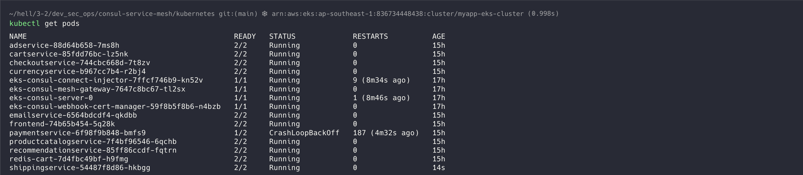
*All microservices running on the primary EKS cluster (AWS), with Consul sidecar proxies.*

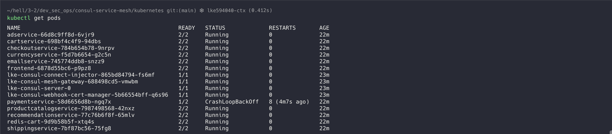
*Consul and shippingservice running on the secondary LKE cluster (Linode) as the failover target.*

### Consul UI

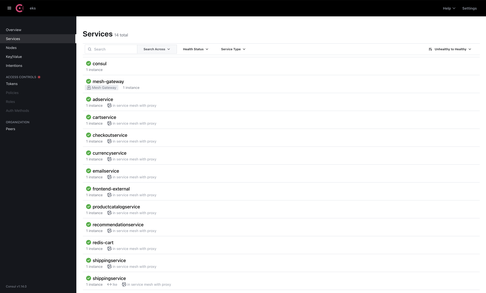
*Consul dashboard on EKS showing all registered microservices.*

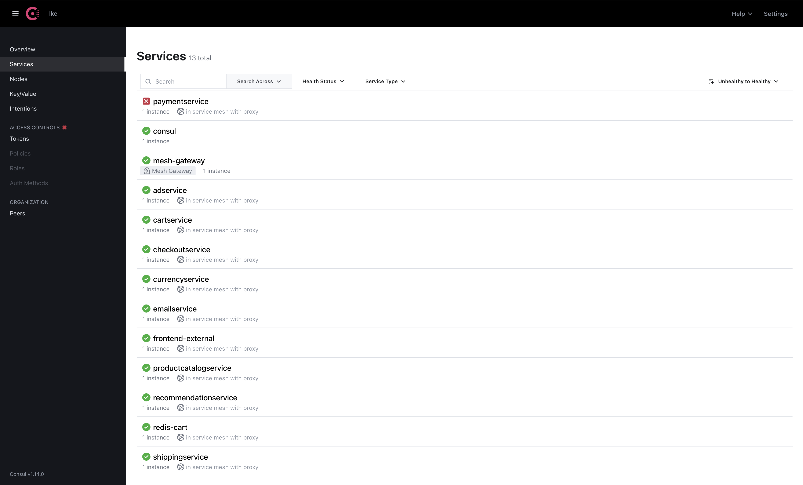
*Consul dashboard on LKE showing the shippingservice registered for failover.*

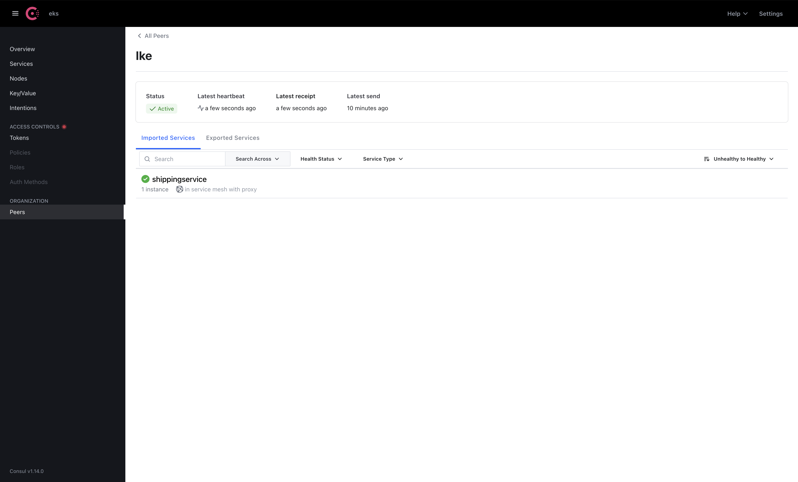
*Cluster peering from EKS side, showing active connection to LKE.*

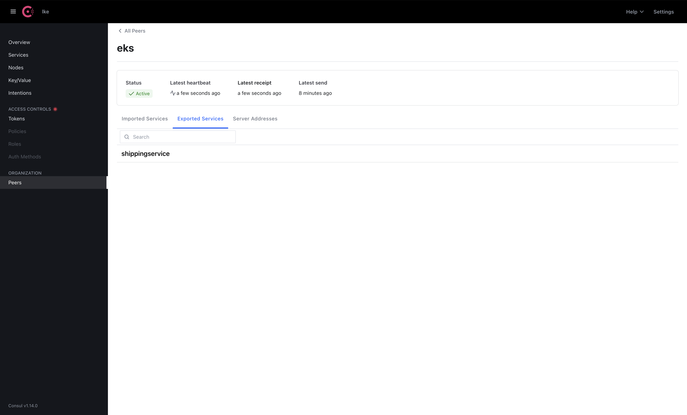
*Cluster peering from LKE side, showing active connection to EKS.*

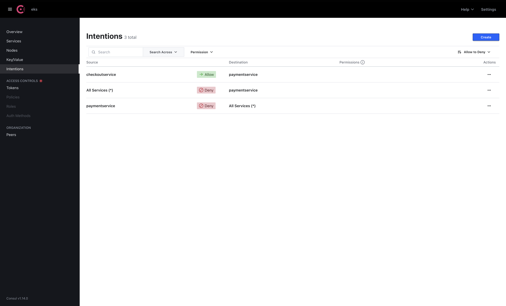
*Service intentions configured to allow cross-cluster communication.*

### Online Boutique Application


*The Online Boutique e-commerce app running and accessible via the frontend LoadBalancer.*

### Failover Demonstration

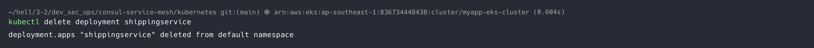
*Scaling down the shippingservice on EKS to simulate a failure.*

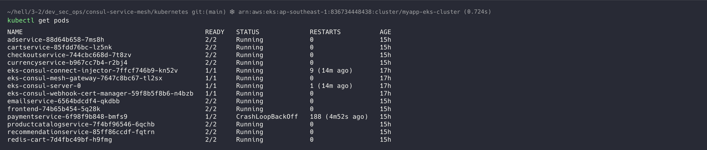
*EKS pods after shippingservice is removed.*

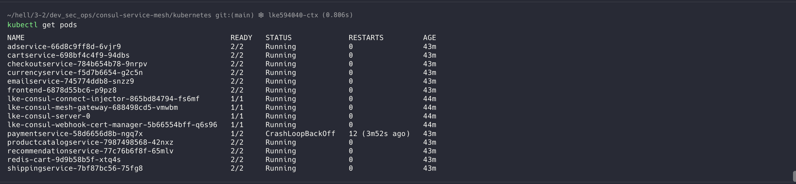
*Shippingservice still running on LKE, handling failover traffic.*

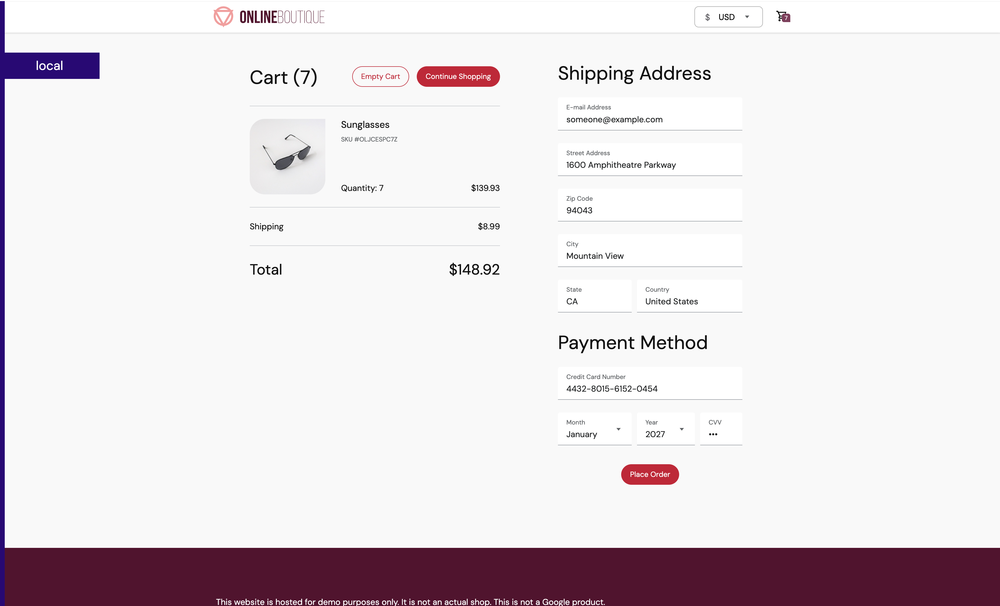
*The website continues to work. Consul routes shipping requests to the LKE cluster via the mesh gateway, demonstrating successful cross-cluster failover.*

## Cleanup

```bash
# Delete Kubernetes resources
kubectl delete -f kubernetes/config-consul.yaml
helm uninstall eks   # on EKS
helm uninstall lke   # on LKE

# Destroy AWS infrastructure
cd terraform
terraform destroy -var-file terraform.tfvars

# Delete LKE cluster via Linode dashboard
```

## Acknowledgments

- **Google Cloud Platform**: [Online Boutique / Microservices Demo](https://github.com/GoogleCloudPlatform/microservices-demo) (Apache 2.0 License). Pre-built container images used from `gcr.io/google-samples/microservices-demo/`.
- **TechWorld with Nana**: [Consul Service Mesh Crash Course](https://www.youtube.com/watch?v=s3I1kKKfjtQ) ([GitLab Repository](https://gitlab.com/twn-youtube/consul-crash-course)). Terraform and Consul configuration files adapted from this tutorial.
- **HashiCorp**: [Consul](https://www.consul.io/) service mesh platform.
